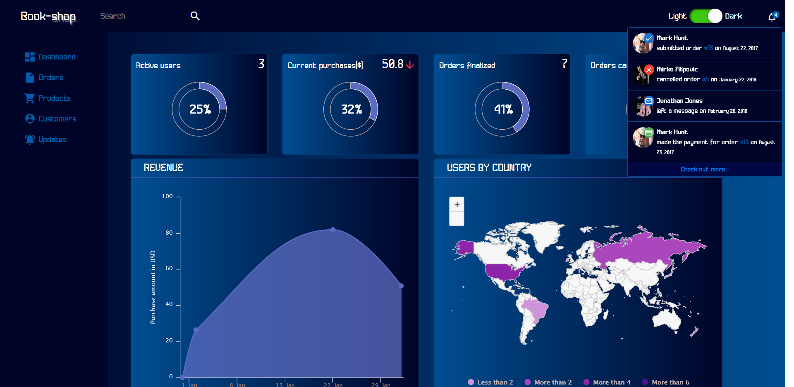
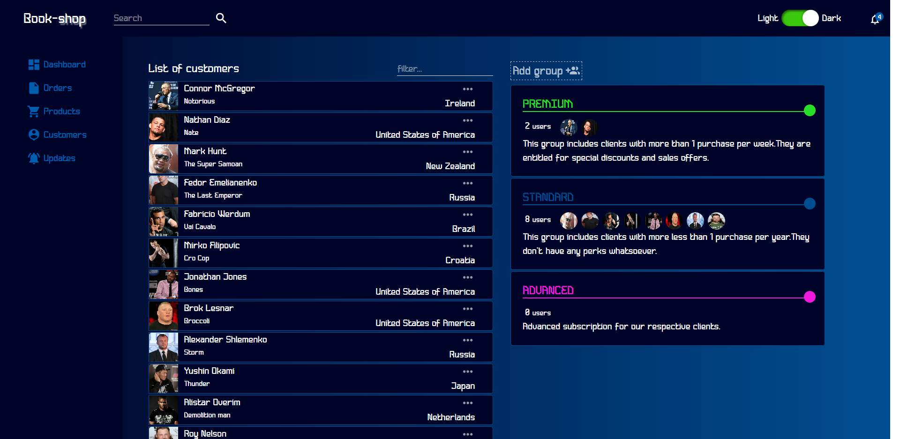
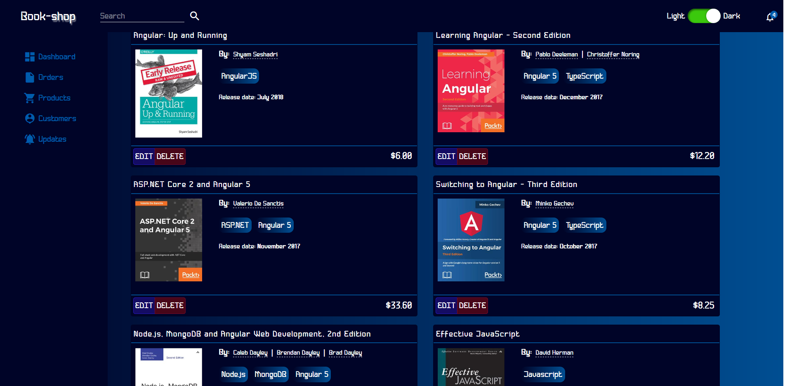

# bookshopDashboard
Admin dashboard of a bookshop built with Angular 5,Redux(ngrx) and chart library Highcharts.js.

Live demo: https://ng-book-dashboard.now.sh/dashboard

Application features:
1) Ability to change css theme;
2) Data representation with charts and maps;
3) Smart tables made from scratch(sorting by date range,text fields,amount;CRUD operations;multifilter of entries);
4) Usage of ngrx as a storage tool;
5) Customers management(adding them to native and custom made groups);

Below the screenshots from app will be presented:

1) Main page. Dashboard charts.

2)Orders smart table.

3)Customers and groups view.

4)Products view.

5)Product edit modal view.

Plans to upgrade:
1)Make the app responsive;
